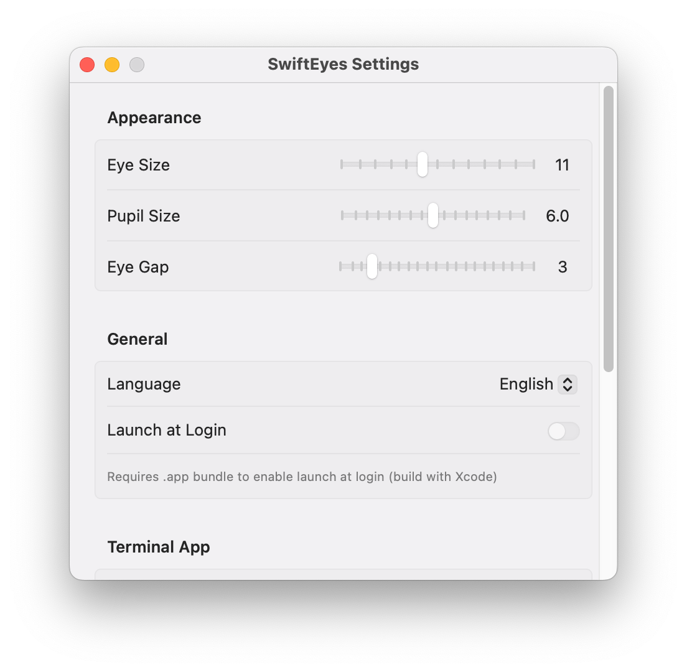

# 👀 SwiftEyes

A lightweight macOS menu bar app that displays a pair of googly eyes that follow your mouse cursor, blink when you click, and provide quick utilities.

Inspired by [Googly Eyes](https://sindresorhus.com/googly-eyes) by Sindre Sorhus.

[中文文档](README_CN.md)

> Made with [OpenCode](https://opencode.ai) / GLM 5.1 Vibe Coding. Thanks to Zhoumo API.


  

## Features

- **Eyes follow mouse** — Each eye independently tracks the mouse cursor; when the cursor is between the eyes, they go cross-eyed 👀
- **Blink on click** — Global left-click → left eye blinks; global right-click → right eye blinks. Hold to keep closed, release to open
- **Left-click → Context menu** — Left-click the menu bar icon for:
  - Current Finder path display (truncated with tooltip) & copy
  - Open terminal
  - Toggle sleep prevention
  - Refresh position
  - Settings...
  - About
  - Quit
- **Right-click left eye → Open Terminal** — Right-click the left eye area to launch your preferred terminal at the Finder's current window path
- **Right-click right eye → Prevent Sleep** — Right-click the right eye area to toggle macOS sleep prevention (highlight turns red when active); auto-deactivates on screen lock or system sleep; persistence mode configurable in Settings (always maintain / don't maintain on sleep-lock / never maintain)
- **Configurable** — Adjust eye size, pupil size, and eye gap via Settings
- **Launch at Login** — Enable auto-start in Settings (requires .app bundle)
- **Minimal resources** — ~0% CPU when idle, only 20–40MB memory

## Requirements

- macOS 13.0 (Ventura) or later
- Xcode 15+ (for .app bundle build)
- Swift 6.0+ / SPM (for bare binary build)

## Build & Run

### Option 1: SPM (Quick Test, No App Bundle)

```bash
git clone https://github.com/WHYBBE/SwiftEyes.git
cd SwiftEyes
swift build -c release
.build/release/SwiftEyes
```

> ⚠️ SPM produces a bare binary without an app bundle. Launch-at-login and Finder path access via Apple Events will not work in this mode.

### Option 2: Xcode (Full .app Bundle, Recommended)

```bash
cd SwiftEyes
open SwiftEyes.xcodeproj
```

Build & run from Xcode (⌘R). Or from the command line:

```bash
xcodebuild -project SwiftEyes.xcodeproj -scheme SwiftEyes -configuration Release -derivedDataPath .build/xcode build
open .build/xcode/Build/Products/Release/SwiftEyes.app
```

To install:

```bash
cp -r .build/xcode/Build/Products/Release/SwiftEyes.app /Applications/
```

## Usage

| Action | Effect |
|--------|--------|
| Move mouse | Pupils follow cursor direction |
| Left-click menu bar icon | Context menu |
| Right-click left eye area | Open terminal at Finder path |
| Right-click right eye area | Toggle sleep prevention |
| Global left-click (anywhere) | Left eye blinks (hold to keep closed) |
| Global right-click (anywhere) | Right eye blinks (hold to keep closed) |
| **Context menu** | |
| ↳ Path / Copy Path | Show (truncated, tooltip for full) & copy Finder's front window path (copy forces fresh fetch) |
| ↳ Open Terminal | Open terminal at Finder path |
| ↳ Prevent Sleep: On/Off | Toggle sleep prevention (auto-deactivates on lock/sleep; persistence mode configurable) |
| ↳ Refresh Position | Recalculate eye centers |
| ↳ Settings... | Open settings window |
| ↳ About | Show about window with repo link |
| ↳ Quit | Quit app |

## Visual Indicators

| State | Left Eye | Right Eye |
|-------|----------|-----------|
| Default | Black pupil, white highlight | Black pupil, white highlight |
| Active (terminal opened) | — | — |
| Active (sleep prevention ON) | — | Black pupil + red highlight |

> The left eye is a one-shot action (open terminal), so it has no persistent active state. The right eye's highlight turns red while sleep prevention is active. Sleep prevention persistence is configurable (always maintain / don't maintain on sleep-lock / never maintain).

### Screenshots

| Left-click blink | Prevent sleep (red highlight) | Settings |
|---|---|---|
|  |  |  |

## Settings

| Setting | Default | Range |
|---------|---------|-------|
| Eye size | 11 | 6–18 |
| Pupil size | 5 | 2–10 |
| Eye gap | 6 | 0–20 |
| Terminal app | /System/Applications/Utilities/Terminal.app | Any .app path |
| Language | 中文 | 中文 / English |
| Launch at login | Off | On/Off |
| Sleep prevention persistence | Don't maintain on sleep/lock, maintain on restart | Always maintain / Don't maintain on sleep/lock / Never maintain |

> Each slider has a reset button (↺) to restore its default value.

## Architecture

```
Sources/SwiftEyes/
├── SwiftEyesApp.swift              # @main entry + AppDelegate
├── Info.plist                      # Bundle metadata (LSUIElement, etc.)
├── SwiftEyes.entitlements          # App sandbox / Apple Events entitlements
├── Assets.xcassets/               # App icon & asset catalog
├── StatusBar/
│   └── StatusBarController.swift   # NSStatusItem + GooglyEyesNSView + context menu
├── Views/
│   ├── GooglyEyesView.swift        # NSView-based eye drawing (Core Graphics)
│   ├── SettingsView.swift          # SwiftUI settings form
│   ├── SettingsWindowController.swift  # NSWindow management
│   └── AboutWindowController.swift     # About window with repo link
└── Services/
    ├── EyesConfig.swift            # ObservableObject for eye parameters + sleep persist mode
    ├── EyesState.swift             # Blink & active state (global monitors)
    ├── MouseTracker.swift          # Global mouse tracking (throttled)
    ├── TerminalLauncher.swift      # Finder path + terminal launch
    ├── SleepPreventer.swift        # IOKit IOPMAssertion (system + display sleep)
    ├── WindowActivationManager.swift  # Reference-counted NSApp activation policy
    └── L10n.swift                  # Localization (Chinese / English)
```

### Key Design Decisions

- **NSView + Core Graphics** — Direct drawing via `NSView.draw()` with `needsDisplay`, no SwiftUI diffing or hosting layer overhead
- **Throttled mouse tracking** — Global `NSEvent` monitor at ~12fps with offset deduplication; `onOffsetChanged` callback triggers redraw only when pupil position actually changes
- **No Combine in hot path** — `MouseTracker` and `EyesState` use plain properties + callbacks instead of `@Published`/`ObservableObject`, eliminating Combine pipeline overhead per frame
- **Coalesced layout updates** — `scheduleUpdateEyeCenters()` batches same-runloop coordinate recalculations when dragging settings sliders
- **IOKit dual assertion** — `PreventUserIdleSystemSleep` + `PreventUserIdleDisplaySleep` held while active; auto-released on screen lock or system sleep; desired state persisted to UserDefaults with configurable persistence mode (always maintain / don't maintain on sleep-lock / never maintain); always-maintain mode re-arms assertions on wake/unlock
- **Cached AppleScript** — Finder path result cached with 2-second TTL for menu display; AppleScript never executed on idle; copy-path and terminal-launch force a fresh fetch bypassing the cache
- **Dirty-rect partial redraw** — Mouse moves invalidate the union of previous and current pupil rects (to avoid move artifacts), not the entire view; full redraw reserved for blink/config changes
- **`hypot` for distance** — Uses `hypot(dx, dy)` instead of `sqrt(dx*dx + dy*dy)` for distance calculation
- **Static CGColor constants** — Eye colors pre-converted to `CGColor` once, avoiding per-frame `NSColor.cgColor` bridging
- **`WindowActivationManager`** — Reference-counted `pushRegular`/`popRegular` so that opening both Settings and About simultaneously won't prematurely flip back to `.accessory` when one closes; keeps the app out of the Dock while allowing windows to come to front
- **L10n dictionary** — In-memory translation table keyed by language code, no .strings files; `language` persisted via UserDefaults

## License

[MIT](LICENSE)
