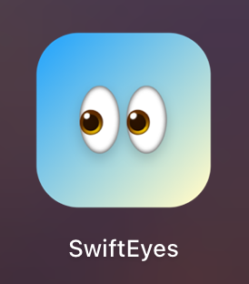
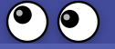
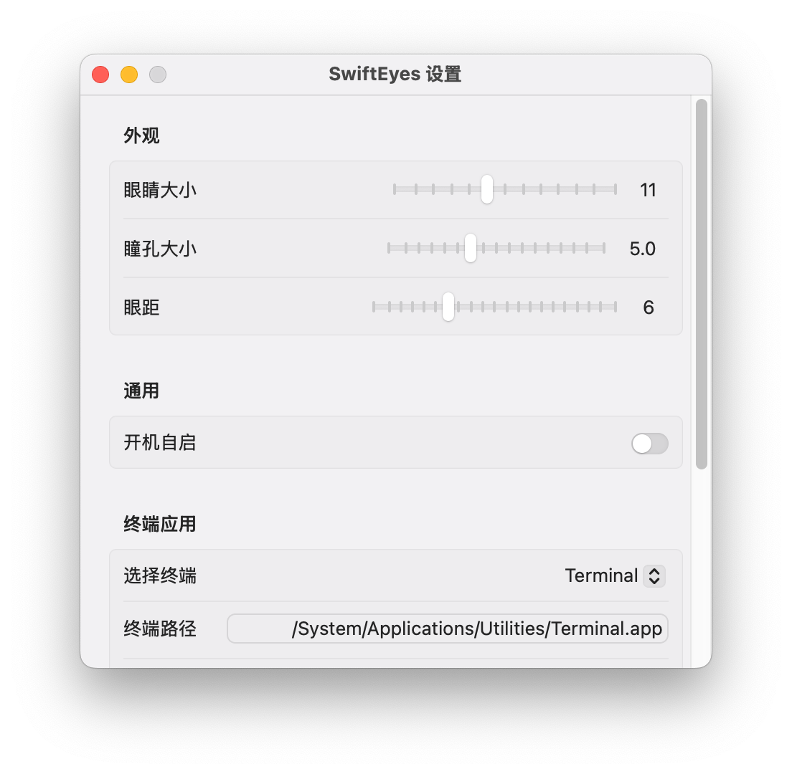

# 👀 SwiftEyes

一个轻量级 macOS 菜单栏应用，显示一双会跟随鼠标移动的 Googly Eyes，点击时眨眼，并提供快捷工具功能。

灵感来自 Sindre Sorhus 的 [Googly Eyes](https://sindresorhus.com/googly-eyes)。

[English](README.md)

使用 [OpenCode](https://opencode.ai) / GLM 5.1 Vibe Coding 而成，感谢 Zhoumo API。




  

## 功能

- **眼珠跟随鼠标** — 每只眼睛独立追踪鼠标光标；鼠标在两眼之间时会斗鸡眼 👀
- **点击眨眼** — 全局左键点击 → 左眼眨眼；右键 → 右眼眨眼。按下保持闭合，松开睁开
- **左眼 → 打开终端** — 点击左眼，在 Finder 当前窗口路径打开终端
- **右眼 → 防止睡眠** — 点击右眼切换 macOS 防睡眠模式（激活时瞳孔发红光）
- **右键菜单** — 右键菜单栏图标：
  - 显示并复制当前 Finder 路径
  - 在此路径打开终端
  - 切换防睡眠
  - 设置
  - 退出
- **可自定义** — 通过设置调整眼睛大小、瞳孔大小、眼距
- **开机自启** — 在设置中启用（需要 .app bundle）
- **极低资源占用** — 空闲时 CPU ≈ 0%，内存仅 20–40MB

## 系统要求

- macOS 13.0 (Ventura) 及以上
- Xcode 15+（构建 .app bundle）
- Swift 5.9+ / SPM（构建裸二进制）

## 构建与运行

### 方式一：SPM（快速测试，无 App Bundle）

```bash
git clone https://github.com/WHYBBE/SwiftEyes.git
cd SwiftEyes
swift build -c release
.build/release/SwiftEyes
```

> ⚠️ SPM 生成的是裸二进制，没有 app bundle。开机自启和通过 Apple Events 访问 Finder 路径在此模式下不可用。

### 方式二：Xcode（完整 .app Bundle，推荐）

```bash
cd SwiftEyes
open SwiftEyes.xcodeproj
```

在 Xcode 中 Build & Run (⌘R)。或从命令行：

```bash
xcodebuild -project SwiftEyes.xcodeproj -scheme SwiftEyes -configuration Release -derivedDataPath .build/xcode build
open .build/xcode/Build/Products/Release/SwiftEyes.app
```

安装到应用程序文件夹：

```bash
cp -r .build/xcode/Build/Products/Release/SwiftEyes.app /Applications/
```

## 使用说明

| 操作 | 效果 |
|------|------|
| 移动鼠标 | 瞳孔跟随光标方向 |
| 左键点击（任意位置） | 左眼眨眼（按住保持闭合） |
| 右键点击（任意位置） | 右眼眨眼（按住保持闭合） |
| 点击菜单栏左眼区域 | 切换：在 Finder 路径打开终端 |
| 点击菜单栏右眼区域 | 切换：防止 Mac 睡眠 |
| 右键点击菜单栏图标 | 上下文菜单 |
| **上下文菜单** | |
| ↳ 当前路径 / 复制路径 | 显示并复制 Finder 前台窗口路径 |
| ↳ 在此打开终端 | 在 Finder 路径打开终端 |
| ↳ 防睡眠: 开启/关闭 | 切换防睡眠模式 |
| ↳ 设置 | 打开设置窗口 |
| ↳ 退出 | 退出应用 |

## 视觉指示

| 状态 | 左眼 | 右眼 |
|------|------|------|
| 默认 | 黑色瞳孔 + 白色高光 | 黑色瞳孔 + 白色高光 |
| 终端已打开 | — | — |
| 防睡眠开启 | — | 红色瞳孔 + 红色发光 + 红色高光 |

> 左眼是瞬时动作（打开终端），无持续激活状态。右眼在防睡眠激活时显示红色发光。

### 截图

| 左键眨眼 | 防睡眠（红色发光） | 设置 |
|---|---|---|
|  |  |  |

## 设置项

| 设置 | 默认值 | 范围 |
|------|--------|------|
| 眼睛大小 | 11 | 6–18 |
| 瞳孔大小 | 5 | 2–10 |
| 眼距 | 6 | 0–20 |
| 终端应用 | Terminal.app | 任意 .app 路径 |
| 语言 | 中文 | 中文 / English |
| 开机自启 | 关 | 开/关 |

## 架构

```
Sources/SwiftEyes/
├── SwiftEyesApp.swift              # @main 入口 + AppDelegate
├── Assets.xcassets/               # 应用图标 & 资源目录
├── StatusBar/
│   └── StatusBarController.swift   # NSStatusItem + GooglyEyesNSView + 右键菜单
├── Views/
│   ├── GooglyEyesView.swift        # 基于 NSView 的眼睛绘制 (Core Graphics)
│   ├── SettingsView.swift          # SwiftUI 设置表单
│   └── SettingsWindowController.swift  # NSWindow 窗口管理
└── Services/
    ├── EyesConfig.swift            # ObservableObject 眼睛参数
    ├── EyesState.swift             # 眨眼和激活状态（全局事件监听）
    ├── MouseTracker.swift          # 全局鼠标追踪（节流）
    ├── TerminalLauncher.swift      # Finder 路径 + 终端启动
    ├── SleepPreventer.swift        # IOKit IOPMAssertion
    └── L10n.swift                  # 中英文本地化
```

### 关键设计

- **NSView + Core Graphics** — 通过 `NSView.draw()` + `needsDisplay` 直接绘制，无 SwiftUI diffing 或 hosting 层开销
- **节流鼠标追踪** — 全局 `NSEvent` 监听 ~12fps 并去重；`onOffsetChanged` 回调仅在瞳孔位置实际变化时触发重绘
- **热路径无 Combine** — `MouseTracker` 和 `EyesState` 使用普通属性 + 回调替代 `@Published`/`ObservableObject`，消除每帧 Combine 管道开销
- **合并布局更新** — `scheduleUpdateEyeCenters()` 将同一 runloop 内的坐标重计算合并，避免拖动滑块时重复调用
- **IOKit 断言** — `IOPMAssertionCreateWithName` 仅在防睡眠激活时持有，关闭时立即释放
- **AppleScript 缓存** — Finder 路径结果缓存 2 秒，空闲时不执行 AppleScript
- **脏区域局部重绘** — 鼠标移动时只 invalidate 瞳孔区域（约 30×30px），而非整个视图；眨眼/设置变更才全量重绘
- **`hypot` 优化距离计算** — 用 `hypot(dx, dy)` 替代 `sqrt(dx*dx + dy*dy)`
- **静态 CGColor** — 眼睛颜色预转换为 `CGColor` 常量，避免每帧 `NSColor.cgColor` 桥接
- **设置窗口** 临时切换 `NSApp.setActivationPolicy(.regular)` 使窗口到前台，关闭时切回 `.accessory`
- **L10n 字典** — 内存中翻译表按语言代码索引，无 .strings 文件；`language` 通过 UserDefaults 持久化

## 许可证

[MIT](LICENSE)
